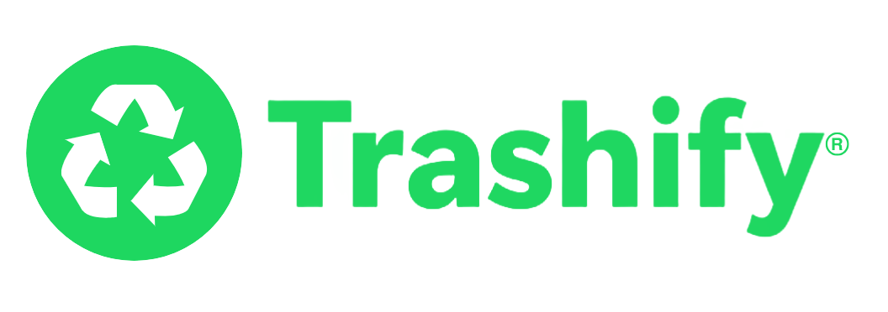

# DA36-mini3-dl3

## 목차
1. 프로젝트 개요
2. 개발배경
3. 시장조사
4. 데이터 취득
5. 데이터 전처리
6. 모델 학습
7. 기대효과
8. 시연 

## 프로젝트 개요

## 개발배경

## 시장조사

## 데이터 취득

생활 폐기물 이미지:
https://www.aihub.or.kr/aihubdata/data/view.do?currMenu=115&topMenu=100&dataSetSn=140

## 데이터 전처리

- 전체 데이터셋은 용량이 크므로 먼저 테스트를 위해 카테고리별 40개 파일 800장의 이미지로 머지 후 테스트 학습
- 각 이미지를 224, 224 크기로 리사이즈

## 모델 학습

- 강한결: MobileNetV2
- 김정아: ResNet50V2
- 김혜영: EfficientNet
- 심정석: Xception

## 기대효과

**사용자 편의성 향상**

가구, 가전제품 등 다양한 대형폐기물을 모델이 자동 분류하고 처리 방법과 비용정보를 알려줌으로써 시민들의 폐기물 신고 절차를 간소화하고 편의성을 증대시켜 사용자 경험 개선 및 폐기물 신고율 증가를 기대할 수 있음

**폐기물 처리 정책 지원**

축적된 지역별, 종류별 폐기물 처리 데이터를 통해 폐기물 처리와 관련된 정책 수립의 근거로 사용할 수 있음

**비즈니스 모델 구축**

사용자의 이미지를 인식하여 대형폐기물 종류를 구분하고, 지자체마다 다른 배출기준 및 금액을 적용하여 사용자가 쉽게 대형폐기물을 분리 배출할 수 있도록 하는 서비스 구축 가능

## 시연 

(유투브 5분 영상 링크 업로드 예정)

## 소감?? 
